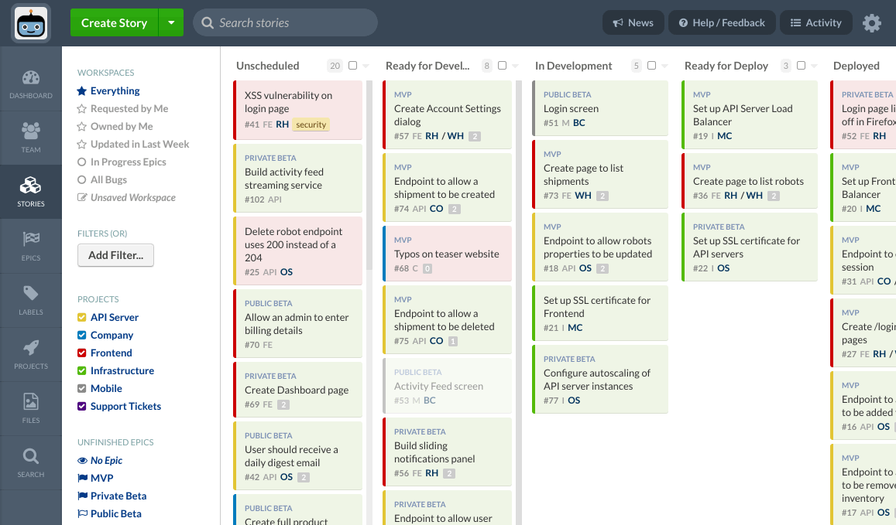

<h1>Welcome abroad!</h1>

We are using ClubHouse

<h1>How to pick tasks ?</h1>
  <ul>
    <li>Pick task from the top of "Ready for development" column</li>
    <li>Alternate between easy and hard tasks(check estimate)</li>
    <li>You can skip uppermost hard task if you have previosly done hard task. Same with easy/easy</li>
    <li>If you have picked a task drag it to the "In development" column immediately</li>
    <li>One task for one developer</li>
    <li>Do not drag tasks to the previous column. Only manager can do this</li>
    <li>You should formulate tasks with verbs. For example: fix logo/create form</li>
    <li>Break one big task into small ones</li>
   
  </ul>
<h1>Humansee labs git style</h1>
<ul>
<li>Branch name: 
${project abbreviation} - ${task number at clubhouse} 
For example: yo-101
</li>
 <li>You should <strong>not</strong> write commit message like "created Home component" or "implemented Login component" instead write "create Home" or "implemented Login". </li>
 <li>Write Pull request name from the task name</li>
 <li>Write answers to comments at Pull requests</li>
 <li>After you are done click Squash and Merge <strong>then</strong> Delete Branch</li>
</ul>
